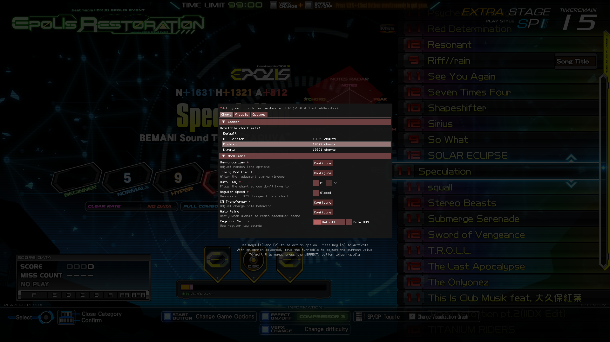

# 2dxtra

A multi-hack for arcade beatmania IIDX

- In-game interface with support for keyboard and controller input
- Automatically blocks invalid scores from being sent to network
- Cheat modifiers such as auto-play, regular speed & CN type override
- Custom chart loader with support for separate score saving via C API
- Novelty modes to combine notes, re-arrange keysounds & swap scratches
- Includes an updated version of [2dxAutoRetry](https://github.com/aixxe/2dxAutoRetry) with additional options
- Ability to increase or decrease each judgement timing window